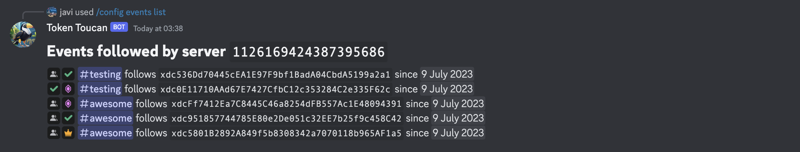
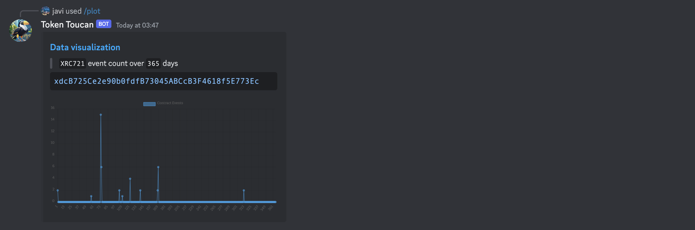
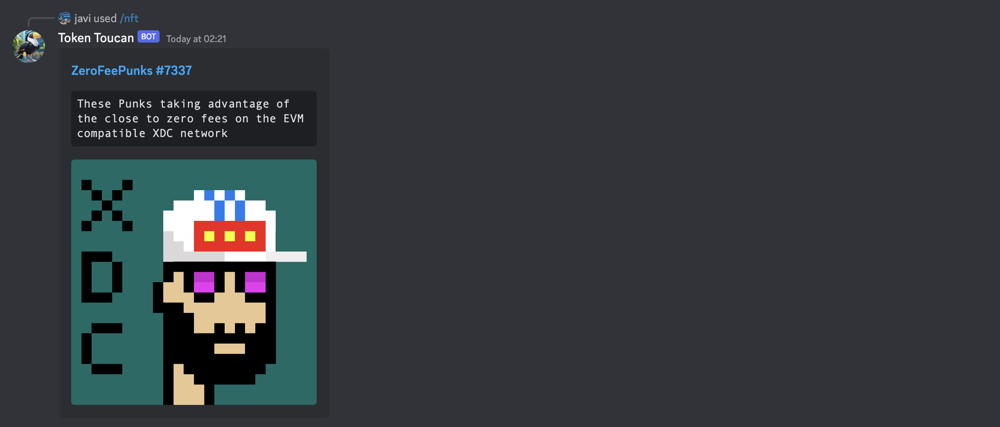
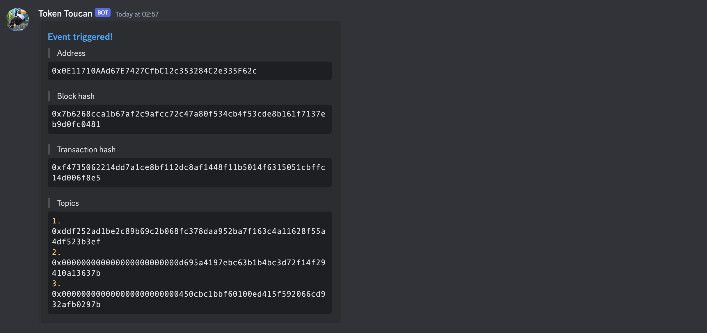

# toucan


**Token Toucan**, the all in one XDC notification bot for Discord.

- Real-time event tracking for `XRC-21` and `XRC-721` contracts.
- Customizable contract `configuration` with real-time notifications.
- NFT `explorer` with metadata viewer.
- Blockchain data export to [`pastebin`](https://pastebin.com/).
- Informative event quantity `plots` for contract analysis.

## commands

The bot currently supports the following `commands`, future development is
planned:

#### follow


```bash
/follow [event] [address]
```

The `follow` command enables users to track events related to a specific address
within a Discord server. Notifications are sent in real-time to the channel
where the command was invoked.

#### unfollow


```bash
/unfollow [address]
```

The `unfollow` command removes real-time event tracking for a specific address
in the current Discord channel.

#### config event list



```bash
/config event list
```

The `config event list` command lists all the addresses being tracked in the
current Discord channel, and the events that are being tracked for each address
by showing a legend of the event icons.

- 
  -> "transfer" event
- 
  -> "approval" event
- 
  -> "approval for all" event
- 
  -> all events

#### config event add


```bash
/config event add [event] [address]
```

The `config event add` command adds new real-time event tracking for the
specified address in the current Discord channel.

> **Warning** You must already follow the address or else it won't work.

#### config event remove


```bash
/config event remove [event] [address]
```

The `config event remove` command removes real-time event tracking for the
specified address in the current Discord channel.

> **Warning** You must already follow the address or else it won't work.

#### plot



```bash
/plot [days] [type] [address]
```

The `plot` command generates a plot of the specified type for the specified
address in the current Discord channel. The plot is generated for the specified
number of days in retrospect.

> **Warning** You must choose the appropiate type for the address: `XRC-21` or
> `XRC-721`.

#### export


```bash
/export [days] [address]
```

The `export` command exports the blockchain data for the specified address to
pastebin.

#### nft



```bash
/nft [token_id] [address]
```

The `nft` command displays the metadata for the specified token id and address
in the current Discord channel.

> **Warning** It must be a valid `XRC-721` address.

## notifications

Once an event is triggered, the bot will send a notification to the channel
where the command was invoked. The notification will contain the following
information:



## license

This project is licensed under the terms of the [MIT license](./LICENSE).
